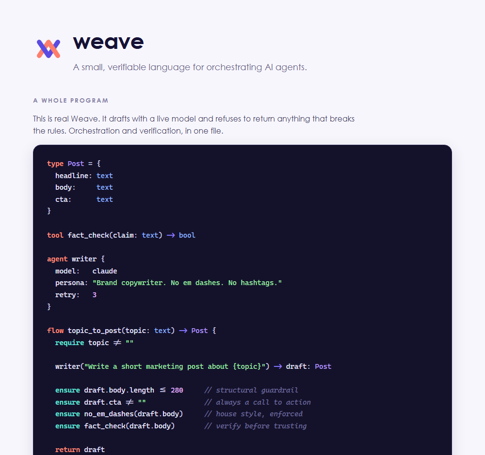

<p align="center">
  
</p>

<h1 align="center">Weave</h1>

<p align="center">A small, verifiable language for orchestrating AI agents.</p>

<p align="center">
  <a href="brand/weave-trailer.mp4"></a><br>
  <sub><a href="brand/weave-trailer.mp4">▶ watch the 18-second intro</a></sub>
</p>



Weave is **not** a faster language and **not** a language an AI writes more fluently than Python (a new language has no training data, so it cannot be). Weave is worth building for a different reason:

> It is small enough that a model can be taught the whole thing in its prompt, constrained enough that the model cannot emit invalid programs, and strict enough that when the model is wrong, a contract catches it immediately instead of in production.

Two ideas, layered:

- **Agent orchestration:** `agent`, `tool`, `flow`, soft calls. The native shape of multi-agent pipelines.
- **Verifiability:** `require` / `ensure` contracts behind a hard fence, a real type checker, and a repair loop that feeds failed contracts back to the model to self-correct.

```weave
agent writer { model: claude, retry: 3 }

flow topic_to_post(topic: text) -> Post {
  require topic != ""
  writer("write a post about {topic}") -> draft: Post
  ensure draft.body.length <= 280
  ensure draft.cta != ""
  ensure no_em_dashes(draft.body)    // built-in lint, enforced by the compiler
  return draft
}
```

## Status

v0 is built and runs (tree-walking interpreter, mock model backend, zero cost). Try it:

```
node src/cli.js check examples/demo.weave
node src/cli.js run   examples/demo.weave --topic "granite countertops"
```

The demo shows the repair loop firing: an over-long draft fails `ensure draft.body.length <= 280`, the contract is fed back to the agent, and the retry passes. See [docs/DESIGN.md](docs/DESIGN.md) for the full design.

## Why "honest" keeps showing up in the docs

This project exists because of a specific objection: a language for AI cannot help an AI write more fluently, because the AI has never seen it. The whole design is the answer to that objection (small enough to teach in-context, constrained so invalid programs cannot be emitted, verifiable so wrong output is caught). If the answer ever stops holding, the docs say to stop, not to keep selling it.

## Naming

The display name is Weave. Bare `weave` is taken on npm, so the npm package and GitHub repo are `weave-lang`; source files use the `.weave` extension. Neighbor to watch: `wandb/weave` (an AI-app toolkit). Full rationale in [docs/DESIGN.md](docs/DESIGN.md#16-naming).

## License

MIT. See [LICENSE](LICENSE).
