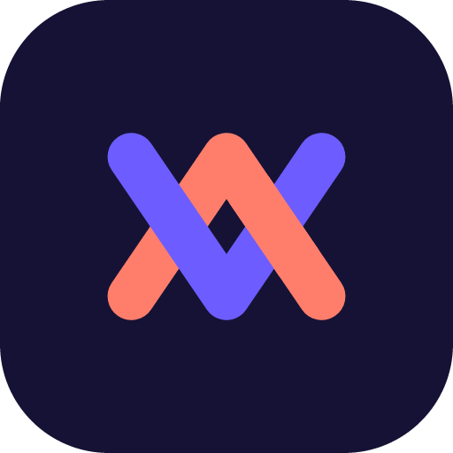
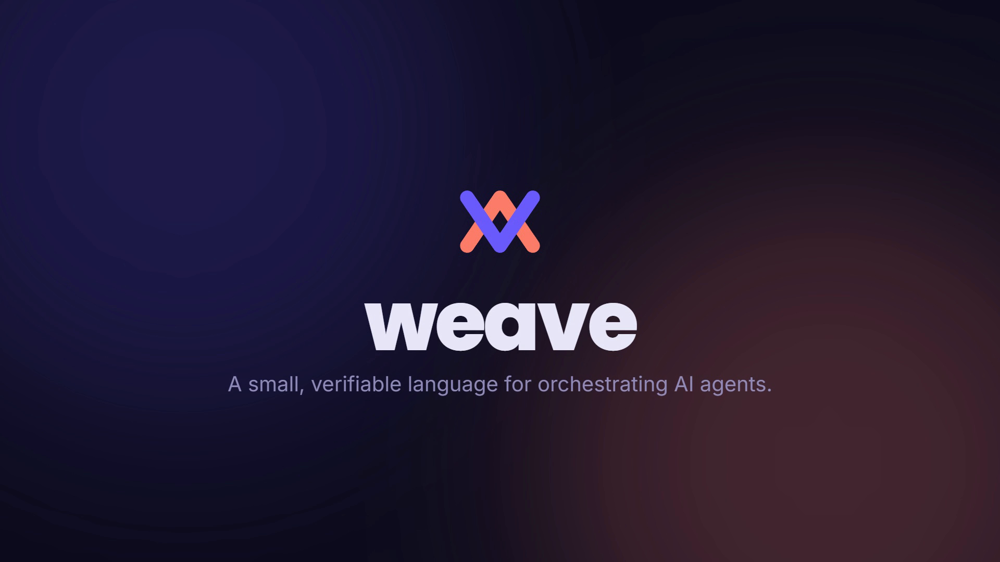
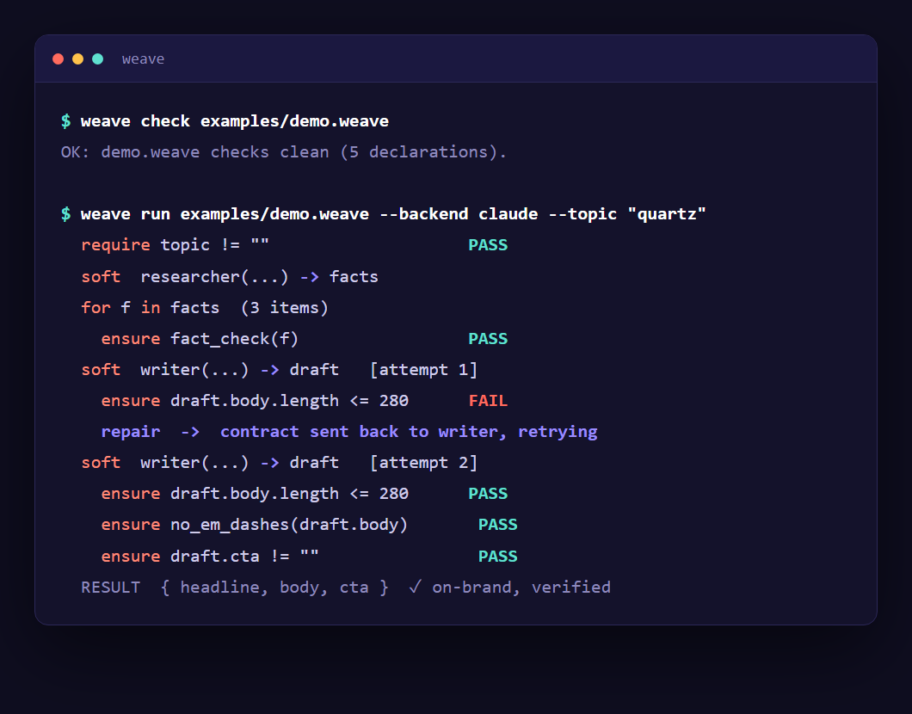

<p align="center">
  
</p>

<h1 align="center">Weave</h1>

<p align="center">A small, verifiable language for orchestrating AI agents.</p>

<p align="center">
  <a href="brand/weave-trailer.mp4"></a><br>
  <sub><a href="brand/weave-trailer.mp4">▶ watch the 18-second intro</a></sub>
</p>



Weave is **not** a faster language, and **not** a language an AI writes more fluently than Python (a brand-new language has no training data, so it cannot be). It is worth building for a different reason:

> It is small enough that a model can be taught the whole thing in its prompt, constrained enough that the model cannot emit an invalid program, and strict enough that when the model is wrong, a contract catches it immediately instead of in production. **Trust, not fluency.**

---

## How it works

A Weave program is a **flow**: a typed pipeline you write once. When you run it, Weave walks the flow top to bottom and, at each step that needs a model, hands it exactly that piece with your inputs filled in. After the step, the **contracts** check the result. If a contract fails, Weave does not return the bad output, it feeds the violated contract back to the model and retries until it passes.

So the file is the single source of truth. The model shows up blank every run, the file feeds it the task, and the language enforces your rules instead of hoping the model follows them.

```
weave check  flow.weave                 # parse + type-check + contract check (no model, no cost)
weave run    flow.weave --backend mock  # run it; pick the brain with --backend
```

---

## The language

Five concepts. That is the entire surface.

| Concept | What it is |
|---|---|
| `type` | A shape for data: records, unions, lists. Where contracts attach. |
| `tool` | A typed binding to a real function: an MCP tool, a CLI, an HTTP call, a plain function. |
| `agent` | A configured model caller: which model, persona, tools, retry budget. |
| `flow` | The program: typed inputs and outputs, a body of steps, contracts. |
| soft call | Calling an agent with a prompt and getting a typed result back. |

```weave
type Post = { headline: text  body: text  cta: text }

tool fact_check(claim: text) -> bool

agent writer {
  model:   claude
  persona: "Brand copywriter. No em dashes. No hashtags."
  retry:   3
}

flow topic_to_post(topic: text) -> Post {
  require topic != ""

  writer("Write a post about {topic}") -> draft: Post

  ensure draft.body.length <= 280     // structural guardrail
  ensure draft.cta != ""              // always a call to action
  ensure no_em_dashes(draft.body)     // house style, enforced
  ensure fact_check(draft.body)       // verify before trusting

  return draft
}
```

The `-> name` bindings are **orchestration**. The `require` / `ensure` lines are **verification**. Different jobs, one file.

An agent that declares `tools` can actually **use** them: a soft call runs a ReAct loop (the model calls a tool, Weave runs the real tool and feeds the result back, repeat) before producing the typed answer. Works over the CLI backends, no API key. See [`examples/research.weave`](examples/research.weave).

### Contracts and the repair loop

`require` is a precondition, `ensure` is a postcondition. When an `ensure` fails on a model's output, the runtime feeds the violated contract back to the agent ("you broke this, fix it") and retries up to the agent's `retry` budget. Guardrail and self-correction in one line.

Contracts live behind a **hard fence**: they may only use comparisons, boolean operators, and calls to a closed registry of built-in lints or `bool`-returning tools. No lambdas, no arbitrary computation. A contract stays decidable and obviously correct, it can never quietly become a second language.

### What contracts can and cannot check

They check **structure** for free: lengths, formats, enum membership, forbidden substrings, "a tool returned true", schema conformance. For **semantic** checks, a `judge` contract asks a reviewer model whether the output meets a rubric:

```weave
ensure judge(critic, "Specific and on-brand, not generic fluff.", draft.body)
```

If the judge fails, its reason is fed back to the writer and it rewrites, so the repair loop corrects for quality, not just format. A judge is a strong heuristic, not a proof, so a human `review` gate still backs anything that truly matters. Weave does not pretend a model reviewer equals truth.

---

## Commands

```
weave check <file.weave>
weave run   <file.weave> [--backend mock|gemini|claude] [--tools module.mjs] [--param value ...]
```

- `--backend mock` (default): deterministic stub, runs free for testing language mechanics.
- `--backend claude` / `gemini`: real models via the Claude / Gemini CLI, using your subscription, **no API key**.
- `--tools module.mjs`: load your own tool registry (bind MCP servers, CLIs, HTTP, functions). The bundled tools are generic stubs.

## Quick start

```
git clone https://github.com/PythonLuvr/weave-lang
cd weave-lang
node src/cli.js run examples/demo.weave --backend mock --topic "your topic"
node test.mjs   # 33 tests, zero dependencies
```

No install step. The language core has no runtime dependencies.

---

## Why "trust, not fluency"

This project exists because of a specific objection: a language for AI cannot help an AI *write* more fluently, because the AI has never seen it. The whole design answers that objection a different way, it is small enough to teach in-context, constrained so invalid programs cannot be expressed, and verifiable so wrong output is caught the instant it happens. If that framing ever stops holding, the docs say to stop, not to keep selling it. See [docs/DESIGN.md](docs/DESIGN.md).

## Naming

The display name is Weave. Bare `weave` is taken on npm, so the npm package and GitHub repo are `weave-lang`; source files use the `.weave` extension. Neighbor to watch: `wandb/weave` (an AI-app toolkit).

## License

MIT. See [LICENSE](LICENSE).
